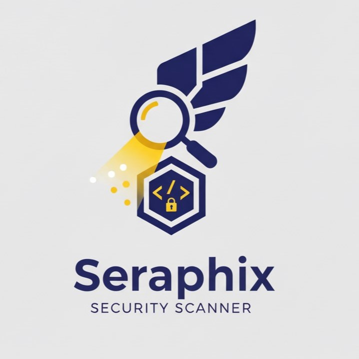
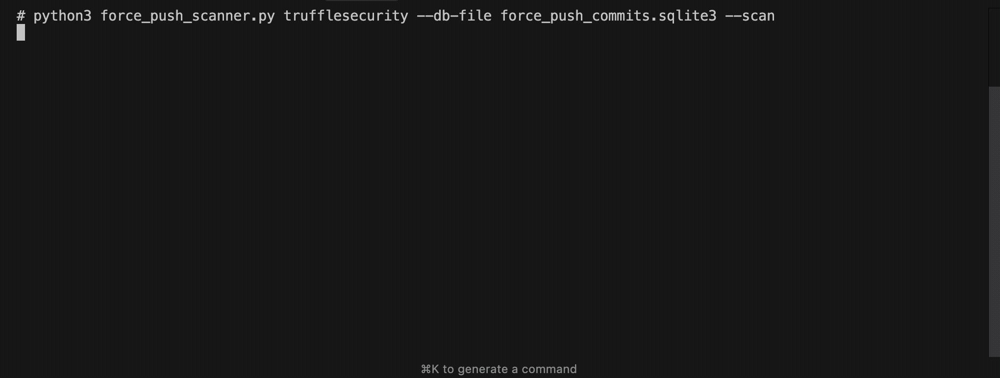

<div align="center">
  
</div>

# Seraphix - Secret Scanner

This tool scans for secrets in dangling (dereferenced) commits on GitHub created by force push events. A [force push](https://git-scm.com/docs/git-push#Documentation/git-push.txt---force) occurs when developers overwrite commit history, which often contains mistakes, like hard-coded credentials. This project relies on archived force push event data in the [GHArchive](https://www.gharchive.org/) to identify the relevant commits. 



This project was created in collaboration with [Sharon Brizinov](https://github.com/SharonBrizinov). Please read [Sharon's blog post](https://trufflesecurity.com/blog/guest-post-how-i-scanned-all-of-github-s-oops-commits-for-leaked-secrets) to learn how he identified force push commits in the GH Archive dataset and made $25k in bounties.

## Quickstart (recommended)

1. Download the Force Push Commits SQLite DB (`force_push_commits.sqlite3`) via a quick Google Form submission: <https://forms.gle/344GbP6WrJ1fhW2A6>. This lets you search all force push commits for any user/org locally.

2. Install dependencies:

```bash
./install_requirements.sh
```

3. **Optional**: Configure timeout settings for optimal scanning performance:

```bash
# Copy timeout configuration template
cp config/timeout_config.sh.example config/timeout_config.sh

# Edit configuration (optional - defaults work for most cases)
nano config/timeout_config.sh
```

4. Scan an org/user for secrets:

```bash
python force_push_scanner.py <org> --db-file /path/to/force_push_commits.sqlite3 --scan
```

### Alternative Usage: BigQuery

If you prefer querying BigQuery yourself, you can use our public table based off the GHArchive dataset (queries are typically free with a Google account). 

```sql
SELECT *
FROM `external-truffle-security-gha.force_push_commits.pushes`
WHERE repo_org = '<ORG>';
```

Export the results as a CSV, then run the scanner:

```bash
python force_push_scanner.py <org> --events-file /path/to/force_push_commits.csv --scan
```

## Project Structure

This project is organized into three main scanning modules:

### � Force Push Scanner (`force-push-scanner/`)
Database-driven scanning with resume capabilities and parallel processing.
```bash
cd force-push-scanner/
./force_push_secret_scanner.sh
```

### 🏢 Organization Scanner (`org-scanner/`)
Direct GitHub API scanning for entire organizations without database requirements.
```bash
cd org-scanner/
./scan_org.sh microsoft
```

### 📦 Repository Scanner (`repo-scanner/`)
Targeted scanning for individual repositories and specific commits.
```bash
cd repo-scanner/
./scan_repo_simple.sh owner/repository
```

### 🔧 Utilities (`utilities/`)
Database management and organization discovery tools.
```bash
cd utilities/
python github_star_counter_parallel.py --db-file /path/to/database.sqlite3
```

## Results Organization

Each scanner module organizes results in its own local directories:

```
📁 Project Root
├── force-push-scanner/
│   ├── leaked_secrets_results/YYYYMMDD_HHMMSS/  # Database-driven scans
│   └── scan_logs/                               # Debug logs (when enabled)
├── org-scanner/
│   ├── leaked_secrets_results/YYYYMMDD_HHMMSS/  # Organization scans  
│   └── scan_logs/                               # Debug logs (when --debug)
└── repo-scanner/
    ├── leaked_secrets_results/YYYYMMDD_HHMMSS/  # Repository scans
    └── scan_logs/                               # Debug logs (when --debug)
```

This structure keeps results and logs organized by scanner type and maintains clear separation between different scan operations.

### Batch Scanner Script (Legacy)

For backward compatibility, the original batch scanner is still available in the root directory:

```bash
./force_push_secret_scanner.sh
```

**What it does:**
The `force_push_secret_scanner.sh` is an enterprise-grade orchestration script that automates large-scale secret scanning across GitHub organizations. It intelligently manages the entire scanning pipeline from organization discovery to result delivery.

**Key features:**
- **Parallel processing**: Scans multiple organizations simultaneously with configurable workers
- **Smart resource management**: Auto-detects system resources and optimizes parallelization  
- **Star-based prioritization**: Queries GitHub API to prioritize high-star organizations first
- **Resume capability**: Can pause/resume long-running scans with state preservation
- **Real-time notifications**: Sends immediate Telegram/email alerts when secrets are discovered
- **Comprehensive logging**: Debug mode with detailed scan logs and performance metrics
- **Graceful interruption**: Clean shutdown with Ctrl+C and automatic cleanup
- **Results organization**: Creates timestamped directories with findings sorted by organization
- **Error resilience**: Timeout protection, retry logic, and failure recovery
- **Database integration**: Works with SQLite database for offline scanning or BigQuery for live data

**Workflow:**
1. **Organization Discovery**: Queries the force push database for all available organizations
2. **Star Count Enrichment**: Fetches GitHub star counts and updates local database (if enabled)
3. **Intelligent Prioritization**: Orders organizations by stars, latest activity, or randomly
4. **Parallel Execution**: Launches multiple organization scans with optimal worker allocation
5. **Secret Detection**: Runs TruffleHog on force-push commits for each organization
6. **Real-time Alerts**: Immediately notifies security teams when verified secrets are found
7. **Result Aggregation**: Collects all findings into organized, timestamped result directories

**Usage examples:**
```bash
# Scan all orgs with default settings (random order, no notifications)
./force_push_secret_scanner.sh

# Scan with notifications enabled
./force_push_secret_scanner.sh --email security@company.com --telegramId 123456789

# Process organizations by star count (high-impact targets first)
./force_push_secret_scanner.sh --order stars

# Scan specific organization with debug logging
./force_push_secret_scanner.sh myorg --debug

# Custom parallelization and database settings
./force_push_secret_scanner.sh --parallel-orgs 4 --workers-per-org 8 --db-file /path/to/custom.db

# Resume interrupted scan
./force_push_secret_scanner.sh --resume

# Start fresh scan (clearing previous state)
./force_push_secret_scanner.sh --restart
```

**Configuration options:**
- `--order random|latest|stars`: Organization processing order (default: random)
- `--email <email>`: Enable email notifications for found secrets  
- `--telegramId <chat_id>`: Enable Telegram notifications (falls back to config file)
- `--parallel-orgs <num>`: Max parallel organizations (default: auto-detected)
- `--workers-per-org <num>`: Workers per organization (default: auto-detected)
- `--db-file <path>`: Custom SQLite database path
- `--resume`: Continue from previous scan state
- `--restart`: Start over from beginning (clears previous state)
- `--debug`: Enable detailed logging and performance metrics

**Notification Setup:**
The script supports both email and Telegram notifications for immediate security alerts:
- Configure email via `config/mailgun_config.sh` 
- Configure Telegram via `config/telegram_config.sh`
- Use `--email` and `--telegramId` parameters to override config files
- Notifications include organization name, secret details, and direct commit links

---

## What the scripts do

### Main Python Scanner (`force_push_scanner.py`)

* Lists zero-commit **force-push events** for `<org>`.
* Prints stats for each repo.
* (Optional `--scan`) For every commit:
  * Identifies the overwritten commits.
  * Runs **TruffleHog** (`--only-verified`) on the overwritten commits.
  * Outputs verified findings with commit link.

### Batch Scanner (`force_push_secret_scanner.sh`)

The batch scanner is a comprehensive orchestration tool designed for enterprise-scale secret scanning operations. It automates the entire pipeline from organization discovery to security team notification.

**Core Functionality:**
* **Multi-organization scanning**: Automatically processes all organizations in the database
* **GitHub API integration**: Fetches star counts and repository metadata for prioritization
* **Intelligent parallelization**: 
  * Auto-detects system resources (CPU cores, RAM) 
  * Optimizes organization and worker allocation for maximum efficiency
  * Prevents system overload while maximizing throughput
* **State management**: 
  * Tracks scan progress with resumable state files
  * Handles interruptions gracefully with cleanup procedures  
  * Supports pause/resume for long-running operations
* **Results organization**: 
  * Creates timestamped directories with findings sorted by organization
  * Generates structured JSON output with verified secret details
  * Maintains scan logs and performance metrics
* **Real-time security notifications**: 
  * Sends immediate alerts when secrets are discovered
  * Supports both email (Mailgun) and Telegram notifications
  * Includes direct links to commits containing secrets
* **Flexible processing strategies**:
  * **Random order**: Better security practice (unpredictable scanning pattern)
  * **Star-based**: Prioritizes high-impact organizations first  
  * **Latest activity**: Focuses on recently active organizations
* **Enterprise features**:
  * Robust error handling with timeout protection
  * Comprehensive logging with debug modes
  * Configuration management via config files
  * Command-line parameter override capabilities

**Technical Implementation:**
* Uses background processes with job control for parallel execution
* Implements proper signal handling for graceful shutdown
* Maintains scan state in JSON format for persistence
* Integrates with TruffleHog for verified secret detection
* Provides real-time progress updates and statistics

---

## Command-line options (abridged)

Run `python force_push_scanner.py -h` for full help.

* `--db-file`     SQLite DB path (preferred)
* `--events-file` CSV export path (BigQuery)
* `--scan`        Enable TruffleHog scanning
* `--verbose`, `-v` Debug logging

---

## FAQs

### What is a Force Push?

A force push (`git push --force`) makes the remote branch pointer move to exactly where your local branch pointer is, even if it means the remote branch no longer includes commits it previously had in its history. It essentially tells the remote to forget its old history for that branch and use yours instead. Any commits that were only reachable through the remote's old history now become unreachable within the repository (sometimes called "dangling commits"). Your local Git might eventually clean these up, but remote services like GitHub often keep them around for a while longer according to their own rules. This action is often done when a developer accidentally commits data containing a mistake, like hard-coded credentials. For more details, see [Sharon's blog post](https://trufflesecurity.com/blog/guest-post-how-i-scanned-all-of-github-s-oops-commits-for-leaked-secrets) and git's documentation on [force pushes](https://git-scm.com/docs/git-push#Documentation/git-push.txt---force).

### Does this dataset contain *all* Force Push events on GitHub?

**tl;dr:** No. This dataset focuses specifically on **Zero-Commit Force Push Events**, which we believe represent the most likely cases where secrets were accidentally pushed and then attempted to be removed.

#### Why focus only on Zero-Commit Force Pushes?

1. **Zero-Commit Force Pushes often indicate secret removal**  
   Developers who push secrets by accident frequently reset their history to a point before the mistake, then force push to remove the exposed data. These types of pushes typically show up as push events that modify the `HEAD` but contain zero commits. Our research indicates that this pattern is strongly correlated with attempts to delete sensitive content.

2. **Not all Force Pushes are detectable from GH Archive alone**  
   A force push is a low-level git operation commonly used in many workflows, including rebasing and cleaning up branches. Identifying every type of force push would require cloning each repository and inspecting its git history. This approach is not practical at the scale of GitHub and is outside the scope of this project.

#### What is an example of a Force Push that is not included?

Consider a scenario where a developer pushes a secret, then realizes the mistake and resets the branch to an earlier state. If they add new, clean commits before force pushing, the resulting `PushEvent` will include one or more commits. This example would not be captured because our dataset only includes push events with zero commits.

### What is the GHArchive?

The GH Archive is a public dataset of *all* public GitHub activity. It's a great resource for security researchers and developers to analyze and understand the security landscape of the GitHub ecosystem. It's publicly available on BigQuery, but querying the entire dataset is expensive ($170/query). We trimmed the GH Archive dataset to only include force push commits.

### Why not host the Force Push Commits DB publicly?

We gate large downloads behind a form to deter abuse; the public BigQuery dataset remains open to all.

### Dataset Updates

The SQLite3 Database and BigQuery Table are updated every day at 2 PM EST with the previous day's data. 

---

This repository is provided *as-is*; we'll review PRs when time permits.

**Disclaimer**: This tool is intended exclusively for authorized defensive security operations. Always obtain explicit permission before performing any analysis, never access or download data you're not authorized to, and any unauthorized or malicious use is strictly prohibited and at your own risk.
